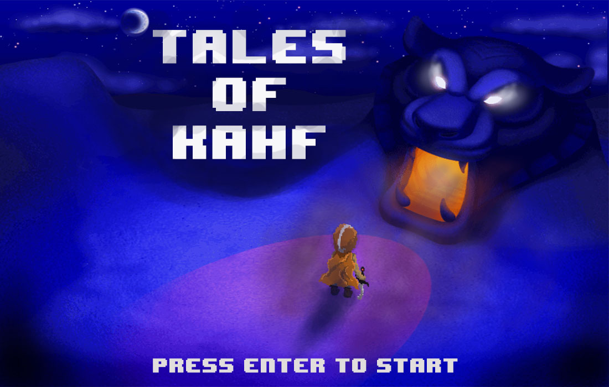

# Projetos
Aqui estão alguns projetos desenvolvidos por mim como forma de me desafiar e até mesmo projetos que eu estava inspirado em tirar do papel.

> Segundo game/projeto que estou desenvolvendo para aparfeiçoar minhas habilidades. 

> Projetos feito em HTML e CSS para portfólio Front-end.

> Esse é o primeiro jogo que desenvolvi. Jogo no estilo plataforma contanto com 3 fases e um inimigo.

### Nota

Os projetos ainda estão em desenvolvimento, mas ao mesmo tempo são projetos que achei legal produzir e quis deixar expostos em um repositório separado.
Outros projetos estão por vir!